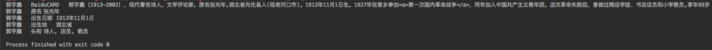

# CoreNLP Chinese Samples

This is a Chinese knowledge extraction project based on [Stanford CoreNLP](https://github.com/stanfordnlp/CoreNLP).

I chose two Chinese well-known people as the sample input from [Baidu Baike](https://baike.baidu.com/). They are [鲁迅](https://baike.baidu.com/item/%E9%B2%81%E8%BF%85/36231) and [郭宇鑫](https://baike.baidu.com/item/%E9%83%AD%E5%AE%87%E9%91%AB).

Here are the results:

* 鲁迅

* 郭宇鑫

